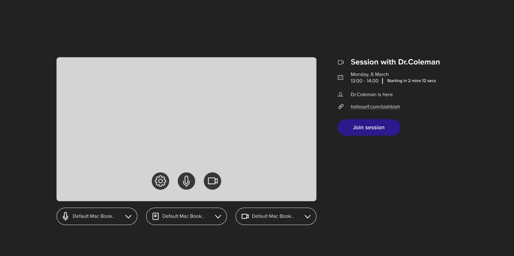

## Take-home exercise
Thank you for taking the time to do this exercise. Please spend no longer than an hour on the below. If you enjoy the excercise and would like to continue, we would be delighted to interview. We will spend the first part of your interview discussing this work.

Please send your answers to alan.thomson@helloself.com.

## Brief: Desired UX
At HelloSelf, therapy sessions are scheduled between therapists and our members well in advance of the session taking place. Sessions take place online. Both the member and the therapist join the session via a video call hosted on the web after logging in. 

The session screen looks like this:

These sessions last for 50 minutes. After the therapist has marked a session as complete, the member is shown a 60-second relaxation video.

## In advance of our interview

Please take no longer than an hour to:
1. Suggest a useful TypeScript representation of application state for both the member and the therapist (who use separate web clients).
1. Describe in words each event that would lead to a change of this state

Please send your answers to me via email.

## The interview
In the first part of the follow-up interview, we will discuss your answers to the above.  

